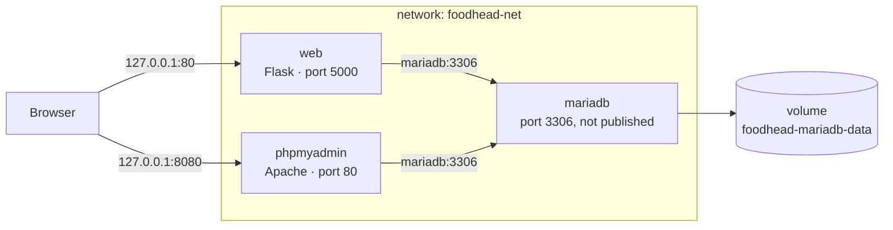
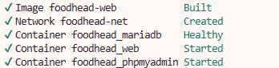
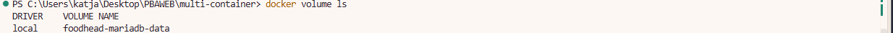
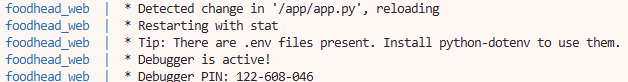
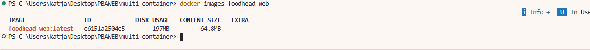
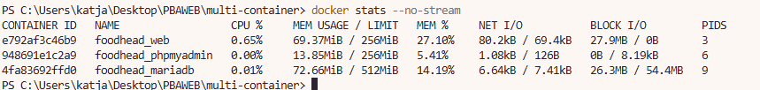
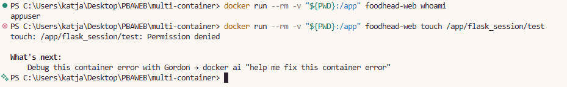
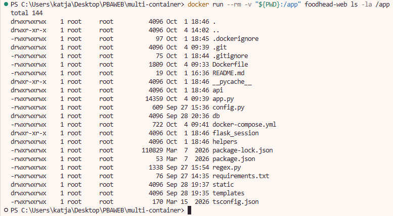

# Foodhead in containers 

In my first semester I built Foodhead, a small recipe-sharing app. In this project I put it in containers, so anyone can clone the repository and run the whole thing with one command, without installing Python or MariaDB themselves. This README explains how to run it, how I set it up and why, and what I would still improve.

<aside>

**Quick start**

`git clone https://github.com/katelijacobsen/multi-container.git` → `cd multi-container` → copy `.env.example` to `.env` → `docker compose up --build -d` → open [http://localhost](http://localhost)

</aside>

## 1. Overview

Foodhead is a recipe app I mad webe with Flask, Jinja templates and MariaDB. You can sign up, log in and share your own recipes with ingredients, step-by-step instructions and a photo. Everyone can browse the recipes, but only the author can edit or delete them.

For this project I did not build anything new. I took the existing app and containerised it. Docker Compose manages:

- **three services:** `web` (my Flask app, built from this repository), `mariadb` (the database) and `phpmyadmin` (a tool to look inside the database)
- **one named network:** `foodhead-net`
- **one named volume:** `foodhead-mariadb-data`

## 2. Architecture



- Your browser only talks to ports on `127.0.0.1`. Docker forwards port 80 to the `web` container's port 5000, and port 8080 to `phpmyadmin`.
- Inside the network, the containers find each other by service name. while My app connects to `mariadb` on port 3306.
- All database data lives in the named volume `foodhead-mariadb-data`.
- Uploaded recipe photos (`static/uploads`) and login sessions (`flask_session`) are saved in the project folder on your computer, through a bind mount (see section 6).

## 3. Before you start

- [Docker Desktop](https://www.docker.com/products/docker-desktop/) / Docker Engine with the Compose plugin. I t
- Git.
- Ports **80** and **8080.** Make sure that they are free on your computer.
- A local `.env` file with your own passwords (step 2 below).

<aside>
🔒

`.env` is listed in `.gitignore`, so it never ends up on GitHub. Do never put real passwords in the README, nor in `.env.example`.

</aside>

## 4. Running and stopping

### Step 1: Clone the repository & get the code

```bash
git clone https://github.com/katelijacobsen/multi-container.git
cd multi-container
```

### Step 2: Create your .env file

Copy the example file and replace the `change-me` values with your own passwords.

```bash
cp .env.example .env
```

| Variable | What it is |
| --- | --- |
| `MARIADB_ROOT_PASSWORD` | Password for the database root user |
| `MARIADB_DATABASE` | Name of the database (`foodhead`) |
| `MARIADB_USER` | The database user my app logs in with |
| `MARIADB_PASSWORD` | Password for that user |
| `FLASK_DEBUG` | `1` while developing (auto-reload), `0` to turn debug off |

### Step 3: Build and start with Docker

```bash
docker compose up --build -d
```

The first start takes a bit longer, because MariaDB creates the database and imports `db/foodhead.sql` by itself. The app waits until the database is healthy before it starts.



*`foodhead_mariadb` becomes `Healthy` before `web` and `phpmyadmin` start.*

### Step 4: Check that everything runs

```bash
docker compose ps
```

You should see three containers that are `Up`, and `foodhead_mariadb` marked as `(healthy)`.

### Step 5: Open the app

- **App:** [http://localhost](http://localhost). The front page shows the 9 sample recipes. Click **Sign up** to make your own user.
- **phpMyAdmin:** [http://localhost:8080](http://localhost:8080). Log in with `MARIADB_USER` and `MARIADB_PASSWORD` from your `.env`.

### Step 6: Stop and remove the containers

```bash
docker compose down
```

This removes the containers and the network, but **keeps the volume**, so your users and recipes are still there the next time you start.

*If you want to reset the database to the sample data from `db/foodhead.sql`, add the `-v` to remove only the volume when you actually want to. It will delete everything that you created in the app:*

```bash
docker compose down -v
```

## 5. configured Docker

| File | What it does |
| --- | --- |
| `Dockerfile` | Builds the `foodhead-web` image in two stages |
| `docker-compose.yml` | Defines the three services, the network, the volume and the resource limits |
| `.dockerignore` | Keeps `.git`, `.env`, `db/`, `docs/`, caches and sessions out of the image |
| `.env.example` | Template for your own `.env` |
| `db/foodhead.sql` | The tables and sample data, imported on the first start |

### The Dockerfile

I split the Dockerfile into two stages, both based on `python:3.12-alpine`:

1. **builder** creates a virtual environment in `/opt/venv` and installs `requirements.txt` into it.
2. **runtime** creates a user called `appuser` (uid 1000), copies only `/opt/venv` and my code, and switches to `appuser` before the app starts.

❗A few choices I made on purpose:

- I copy `requirements.txt` before the rest of the code. Docker caches that layer, so packages are only reinstalled when the requirements change, not every time I edit `app.py`.
- The virtual environment lives in `/opt/venv`, outside `/app`. In Compose I mount my project folder on top of `/app`, and that would otherwise hide the installed packages.
- The app listens on port 5000, Flask's default, instead of port 80, which traditionally needs root.
- The image starts `flask run` **without** debug mode. Debug mode lets people run code through the browser, so I only turn it on with `FLASK_DEBUG=1` while developing.

### The services in docker-compose.yml

| Service | Image | Port on my computer | Key settings | Limits |
| --- | --- | --- | --- | --- |
| `web` | built from my Dockerfile, tagged `foodhead-web` | `127.0.0.1:80` → 5000 | Database settings and `FLASK_DEBUG` from `.env`, bind mount `.:/app`, waits for a healthy database | 0.5 CPU, 256 MB |
| `mariadb` | `mariadb:10.6.20` | Nope | Creates the app user from `.env`, stores data in the volume, imports `db/foodhead.sql`, has a healthcheck | 1 CPU, 512 MB |
| `phpmyadmin` | `phpmyadmin/phpmyadmin` | `127.0.0.1:8080` → 80 | Connects to `mariadb`, waits for a healthy database | 0.5 CPU, 256 MB |

The healthcheck was important to me. `depends_on` on its own only waits until the database container has *started*, not until MariaDB is ready to answer. With `condition: service_healthy`, my app waits until it actually is.

### Changing the setup

- `docker compose config` shows the final configuration with the values from `.env` filled in. It also prints your passwords, so don't share or screenshot that output.
- To use other ports, change the left side of a port mapping, for example `"127.0.0.1:8000:5000"`.
- To change the limits, edit `deploy.resources.limits` for the service.
- To turn debug off, set `FLASK_DEBUG=0` in `.env` and run `docker compose up -d`. Compose recreates the `web` container with the new value.

## 6. Volumes

| Args | Path | Stored Content |
| --- | --- | --- |
| `foodhead-mariadb-data` | `/var/lib/mysql` in `mariadb` | All database data: users, recipes, ingredients and steps |
| `.` (the project folder) | `/app` in `web` | My code, uploaded photos and login sessions |
| `./db/foodhead.sql` | `/docker-entrypoint-initdb.d/` in `mariadb` | The SQL script imported on the first start |



- After `docker compose down` and `docker compose up -d`, everything is still there: the database is in the volume, and the photos are on my disk.
- Rebuilding the image doesn't touch any data.
- Only `docker compose down -v` deletes the database. On the next start it is imported again from `db/foodhead.sql`.

The bind mount is also what makes development nice. When I change a template and refresh the browser, the change is there right away, without rebuilding the image. With `FLASK_DEBUG=1`, saving `app.py` makes Flask restart by itself, and the log says `Detected change in '/app/app.py', reloading`.



## 7. Networking

- All three services are on `foodhead-net`. I gave it a fixed name, so Docker doesn't put the folder name in front of it.
- The containers talk to each other by service name. That's why `DB_HOST` is simply `mariadb`.
- There are two kinds of ports. The **host ports** are what your browser uses: `localhost:80` and `localhost:8080`. The **container ports** are used inside the network: 5000 for the app and 80 for phpMyAdmin.
- **The database port it set to privat, not published.** Only the app and phpMyAdmin need the database, and they reach it through the network, so nothing outside Docker can connect to it.
- The app and phpMyAdmin only listen on `127.0.0.1`, so other devices on the same Wi-Fi can't reach them. That matters because debug mode is on while I develop.
- For a public demo I can use [ngrok](https://ngrok.com): set `FLASK_DEBUG=0` first, then run `ngrok http 80`.

## 8. Security and efficiency

### Practice

- **Foodhead doesn't run as root.** `docker compose exec web id` shows `uid=1000(appuser)`, and `docker top foodhead_web` shows the Flask process running as user 1000. MariaDB runs as uid 999, the `mysql` user from its official image.
- **Minimizing the image:** It went from 368 MB (the original: `python:3.9-slim`, one stage, running as root) to 197 MB.
- **Fewer files in the image.** `.dockerignore` keeps `.git`, `.env`, `db/`, `docs/`, caches and sessions out.
- **No passwords in the repository.** They are in `.env` and reach the containers as environment variables.
- **Foodhead has its own database user** with access to the `foodhead` database only, instead of using root.
- **As few open ports as possible.** The database has none, and the rest only listen on `127.0.0.1`.
- **Debug mode is off by default** and only on through `.env` while developing.



### Insights

- Most of the size saving comes from `alpine`, not from the two stages.`python:3.12-slim` has been tested with the same two stages first, and it was 372 MB. On Alpine, the MySQL driver installs as plain Python instead of with its large C extension. The two stages will matter more as soon as a package needs compiling, because the build tools then stay in the builder stage.
- "Rootless" in my project means the app runs as a normal user inside its container. **Docker Desktop itself is not running in rootless mode**.
- The official phpMyAdmin image starts Apache as root and runs its workers as `www-data`. I use the image as it is.
- Because of the bind mount, the `web` container runs the code from my project folder, not the code baked into the image. It also means `.env` is visible inside that container.

## 9. Testing the container

| Command | Insights | Outcome |
| --- | --- | --- |
| `docker compose config` | The final configuration with values from `.env` | `FLASK_DEBUG` and the database settings filled in |
| `docker compose ps` | Status and health | Three containers up, `foodhead_mariadb (healthy)` |
| `docker compose logs --tail=50 web` | The Flask log | `Debug mode: on` with `FLASK_DEBUG=1`, `Debug mode: off` with `0` |
| `docker compose exec web id` | Which user the app runs as | `uid=1000(appuser) gid=1000(appuser)` |
| `docker images foodhead-web` | Image size | 197 MB |
| `docker stats --no-stream` | CPU and memory against the limits | See the table below |

Use `docker stats --no-stream` to look into the recourses, while the stack was idle after running for about 26 minutes:

| Container | CPU | Memory / limit |
| --- | --- | --- |
| `foodhead_web` | 0.01 % | 29.5 MiB / 256 MiB |
| `foodhead_mariadb` | 0.01 % | 91.5 MiB / 512 MiB |
| `foodhead_phpmyadmin` | 0.00 % | 15.9 MiB / 256 MiB |

All three stay far below their limits, but keep in mind these numbers are from an idle stack, not under load.



*An earlier run of the same command. The exact numbers change from run to run, but every container stays well under its limit.*

**Try it yourself :)**

1. Open [http://localhost](http://localhost): the front page lists the recipes from the database.
2. Sign up, log in and create a recipe with a photo.
3. Run `docker compose down` and then `docker compose up -d`. Your recipe and its photo are still there.

## 10. Limitations and what I'd do next

It isn't perfect, and these are the parts I know about:

- **Create .env yourself.** Without it, Compose warns that the variables are missing, MariaDB refuses to start without a root password, and the app keeps waiting for a healthy database.
- **No database migrations.** `db/foodhead.sql` only runs on an empty volume. When I improved the recipe descriptions in the SQL file, my running database still showed the old text. The only way to load the new file is `docker compose down -v`, which also deletes everything created in the app.
- **It's set up for development, not production.** The bind mount, auto-reload and Flask's built-in server are great while I work on the code, but not for real users.
- **Uploaded photos end up in the project folder,** and the sample photos are committed to Git together with the code.
- **No automated tests,** and only the database has a healthcheck.
- `package.json` and `package-lock.json` are leftovers from the original project and aren't used by the containers.

**What I'd do next:**

1. Run the app with Gunicorn, a production server, instead of `flask run`.
2. Make a production setup without the bind mount, so the image's own code is used, and store uploads in a named volume.
3. Add a healthcheck for `web` and pin phpMyAdmin to a fixed version.

## Reflection

The biggest lesson for me: adding `USER appuser` to the Dockerfile was not enough on its own. My first version of the setup ran as root, and it left folders like `flask_session` and `__pycache__` in my project that were owned by root. When the app started running as `appuser`, it got **Permission denied** trying to save sessions into them.





Deleting the folders fixed it, and Flask created `flask_session` again, now owned by `appuser`. Since then I don't trust a security setting until I have tested it.

I also learned how much a healthcheck matters, why the database doesn't need a port on my computer, and that a volume only gets its seed data the very first time.

## Troubleshooting

- The front page says "Database under maintenance"
    
    The SQL file is only imported the first time the volume is empty. Run `docker compose down -v` and then `docker compose up -d`.
    
- Permission denied in `flask_session` or `__pycache__`
    
    These folders were created by root in an older version of the setup. Delete them on your computer. Flask creates `flask_session` again as `appuser`.
    
- Port 80 or 8080 is already in use
    
    Change the left side of the port in `docker-compose.yml`, for example `"127.0.0.1:8000:5000"`.
    

## Project structure

```
├── app.py              # Flask app: pages and recipe routes
├── api/user.py         # Sign up and login routes
├── config.py           # Database connection, reads DB_* environment variables
├── regex.py            # Shared validation rules
├── helpers/            # Validation, formatting and caching helpers
├── templates/          # Jinja templates
├── static/             # CSS, JavaScript, fonts, images and uploads
├── db/foodhead.sql     # Tables and sample data, imported on the first start
├── docs/screenshots/   # Screenshots used in this README
├── Dockerfile          # Two-stage build, non-root user
├── docker-compose.yml  # web, mariadb and phpmyadmin, network, volume and limits
├── .dockerignore       # Files kept out of the image
└── .env.example        # Template for your own .env
```


## Credits

- [mixhtml](https://mixhtml.com) by Santiago Donoso
